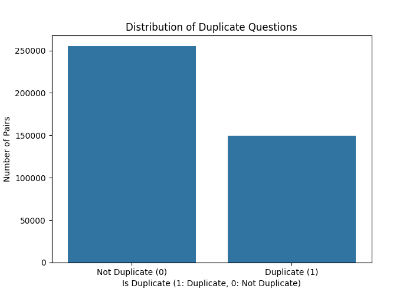
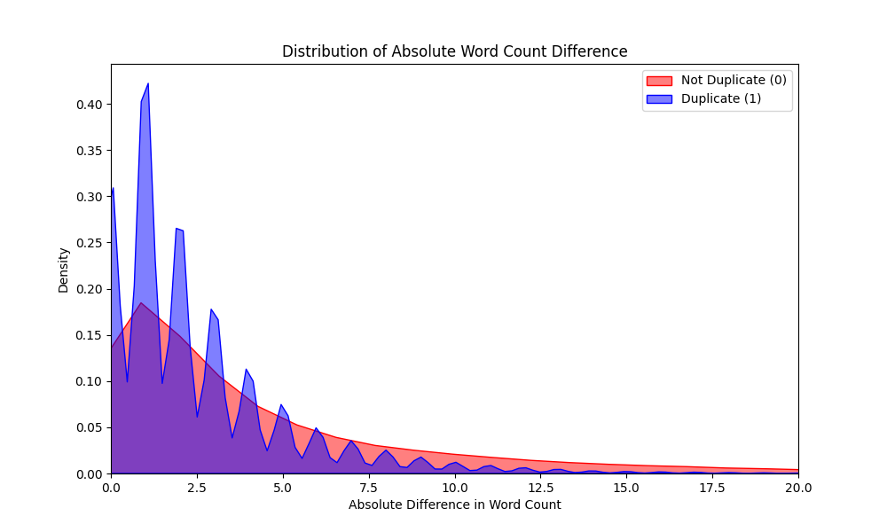
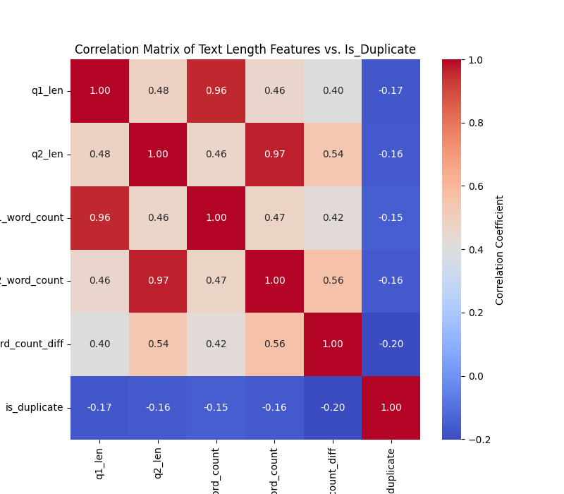
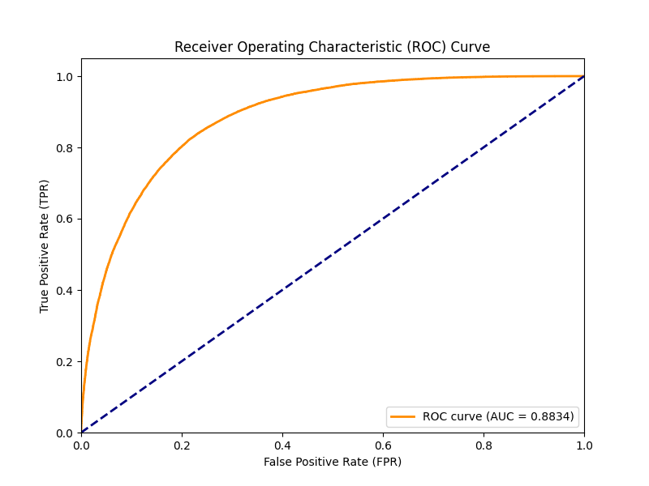
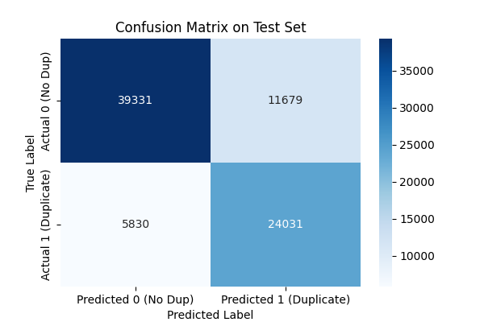
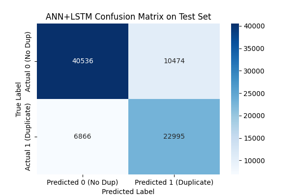
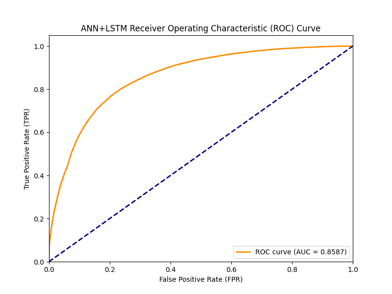
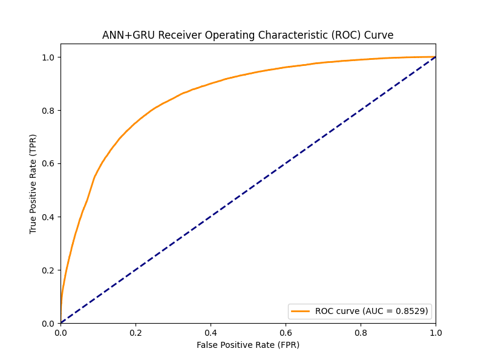

#  Quora Question Pair Similarity Classification

This project aims to build a machine learning model to classify pairs of questions from the Quora platform as either **duplicate** (semantically similar) or **not duplicate**. The solution involves comprehensive Exploratory Data Analysis (EDA), robust text preprocessing, feature engineering, and binary classification using a high-performing model.

## 🎯 Goal

To predict the target variable `is_duplicate` (1 for duplicate, 0 for not duplicate) based on the text of `question1` and `question2`.

---

## 🚀 Step 1: Exploratory Data Analysis (EDA)

The EDA phase focused on understanding the data structure, identifying class imbalance, and extracting initial predictive features based on question text length.

### 1. Class Imbalance Check

* **Analysis:** The distribution plot shows that approximately **63%** of the pairs are **Not Duplicate** (0), while only **37%** are **Duplicate** (1).
* **Impact:** Due to this class imbalance, we must use **F1-Score** and **AUC-ROC** as primary evaluation metrics, as simple accuracy would be misleading. For Model training, we have to go trough over sampling or under sampling for better model performane

  

### 2. Length Feature Analysis (Word Count Difference)

* **Feature:** The `word_count_diff` feature was engineered to measure the absolute difference in word count between the two questions in a pair.
* **Analysis:** The KDE plot shows that the distribution for **Duplicate** pairs (blue curve) is highly concentrated around **zero** difference. This is a critical finding, confirming that pairs of questions with very similar lengths are much more likely to be true duplicates.

  

### 3. Sentence Length Distribution

This plot analyzes the distribution of the **word count** for both Question 1 and Question 2 after initial cleaning.

* **Key Insight:** The density curves for $Q1$ and $Q2$ overlap almost perfectly, with the peak around 8–12 words. This confirms that questions in the dataset are **structurally similar in length** across the board. This basic characteristic needs to be augmented by more semantic features to distinguish duplicates.

  

### 4. Common Words Count vs. Duplication

This box plot compares the number of words shared between the question pairs, directly against the target variable.

* **Feature:** This plot visualizes the predictive power of the **`common_words`** feature (count of intersecting words).
* **Key Insight:** The median and overall distribution for the **Duplicate (1)** group is shifted significantly **higher** than the Non-Duplicate (0) group. This is a critical finding: pairs that are true duplicates share a far greater number of words. The `common_words` count is, therefore, a **highly effective feature** for the classification model.

  

### 5. Word Cloud Comparison

These visualizations show the most frequent words (excluding common English stopwords) used in the questions, separated by the duplication status.

#### **Word Cloud for Duplicate Pairs**

* **Key Insight:** This cloud confirms that duplicate questions frequently cluster around **specific, narrow topics** (e.g., product names, popular technologies, financial terms). The highly prominent words here serve as strong indicators of where the core duplication issues lie.

  

#### **Word Cloud for Non-Duplicate Pairs**

* **Key Insight:** Words in this cloud are generally **more generic or broad**. Comparing the two clouds shows that questions marked as non-duplicate have a wider variety of themes, lacking the intense frequency clustering seen in the duplicate set.

  

### 6. Feature Correlation Matrix Analysis

This visualization, a **Heatmap**, quantifies the linear relationship between the simple numerical features (length and count) and the target variable, `is_duplicate`.

  

* **What Correlation Means:** Values range from $+1.0$ (perfect positive relationship) to $-1.0$ (perfect negative relationship). A value close to $0$ means little to no linear relationship.

| Relationship | Correlation Coefficient | Interpretation |
| :--- | :--- | :--- |
| **`word_count_diff` vs. `is_duplicate`** | **$-0.20$** | **The most significant signal.** This indicates a weak but important **negative correlation**. As the absolute difference in word count increases (i.e., questions become more structurally dissimilar), the probability of the pair being a duplicate decreases. |
| **Individual Lengths/Counts vs. `is_duplicate`** | $\approx -0.15$ to $-0.17$ | The individual length/word count of $Q1$ or $Q2$ has a very weak relationship with duplication, confirming that the **difference** between the two questions is a much stronger indicator than their individual sizes. |
| **Internal Feature Correlation** | $\approx +0.95$ to $+0.97$ | Notice the high correlation between `q1_len` and `q1_word_count` (and similarly for $Q2$). This is expected: more characters generally mean more words. This confirms our features are consistent. |

**Conclusion:** The $-0.20$ correlation from `word_count_diff` confirms our hypothesis from the KDE plot: **structural similarity is predictive of duplication**, and this engineered feature is the most valuable simple numerical feature we can add to our text model.

---

## ⚙️ Step 2: Text Preprocessing and Feature Engineering

This step transformed the raw text into a high-dimensional feature matrix suitable for machine learning, while also managing class imbalance.

### 1. Preprocessing Pipeline

The cleaned text underwent the following normalization process:

* **Standardization:** Lowercasing, removal of special characters, punctuation, and English stopwords.
* **Normalization:** Applied **Lemmatization** (using NLTK's WordNetLemmatizer) to reduce words to their base or root form (e.g., "running" becomes "run"), which helps the model treat different word forms as the same feature.

### 2. Feature Extraction and Matrix Creation

We used a combined approach for feature extraction:

1.  **Vectorization (TF-IDF):** Questions were vectorized using **Term Frequency-Inverse Document Frequency** (TF-IDF), limited to the top 20,000 most frequent words.
2. **Feature Stacking:** The final feature matrix was constructed by combining four distinct sets of features:
 
 * **Absolute Difference Vector** ($\mathbf{|TFIDF_{Q1} - TFIDF_{Q2}|}$): This captures the **dissimilarity** between the questions.
 * **Element-wise Product Vector** ($\mathbf{TFIDF_{Q1} \cdot TFIDF_{Q2}}$): This captures the **overlap** between the questions.
 * **`common_words`** (Engineered numerical feature): A direct count of shared words.
 * **`word_count_diff`** (Engineered numerical feature): The absolute difference in question length.

* **Final Feature Matrix Shape:** `(404351, 40002)`
    * *Explanation:* The matrix has 404,351 rows (original data points) and **40,002 columns** (features). This comes from (20,000 difference features + 20,000 product features + 2 numerical features).

### 3. Data Splitting and Stratification

The data was split into Training, Validation, and Testing sets using stratification to ensure the duplicate ratio ($\approx 37\%$) is maintained across all three sets.

| Set | Proportion | Size (Rows) | Purpose |
| :--- | :--- | :--- | :--- |
| **Training** | 70% | 283,045 | Model learning and fitting. |
| **Validation** | 10% | 40,435 | Hyperparameter tuning and model selection. |
| **Testing** | 20% | 80,871 | Final, unbiased evaluation of the best model. |

### 4. Class Imbalance Correction (Oversampling)

To prevent the model from being biased toward the majority class (Non-Duplicates), **Random OverSampling (ROS)** was applied *only* to the training set.

* **Original Training Duplicates (1):** 104,514
* **Resampled Training Duplicates (1):** 178,531
* **Resampled Training Total Size:** 357,062 rows

The training data is now perfectly balanced (50/50), which is essential for achieving reliable **Precision** and **Recall** metrics.

## 💡 Why Sequence Preprocessing is Essential for LSTMs/GRUs

Switching from the wide **TF-IDF vectors** to **Sequence Preprocessing** (Tokenization and Padding) was a necessary step because the new architecture, the **Siamese LSTM/GRU Network**, requires a fundamentally different input structure.

These Recurrent Neural Networks (RNNs) are designed to process data **sequentially**, one word at a time, to capture context and word order.

### 1. The Critical Mismatch

| Feature | TF-IDF Vectorization | Sequence Vectorization |
| :--- | :--- | :--- |
| **Model Type** | Optimized for Logistic Regression, XGBoost, Dense ANN. | **Required** for LSTM, GRU, and Transformer Models. |
| **Input Style** | One massive, wide, sparse vector ($\mathbf{40,002}$ dimensions). | Two short, fixed-length vectors ($30$ tokens) per question. |
| **Word Order** | **Lost.** Treats the question as a "bag of words"—order is ignored. | **Preserved.** The tokens are ordered exactly as they appeared in the question, allowing the RNN to learn dependencies. |
| **Memory Constraint** | High risk of running out of **Host RAM** when converting the sparse vector to a dense array for standard Keras/TensorFlow input. | Low memory footprint due to the short, fixed-length input vectors, avoiding RAM crashes. |

### 2. The Sequence Preprocessing Pipeline

The refactoring of Step 2 specifically generated the required inputs for the Siamese RNN structure:

#### A. Tokenization
* **Objective:** Convert every unique word into a corresponding integer index.
* **Result:** The question text transforms from a string of words into a **sequence of numbers** (e.g., "how invest money" $\to$ `[10, 50, 15]`). This sequence is the only format the RNN's initial layer can accept.

#### B. Padding
* **Objective:** Standardize the length of all sequences to a fixed size ($\mathbf{30}$ tokens).
* **Why it's needed:** Deep learning frameworks require all input samples in a batch to have a uniform dimension. Shorter sequences were filled with zeros (`0`), and longer sequences were truncated to meet the $\mathbf{30}$ token limit.

#### C. The Role of the Embedding Layer
The final integer sequence is fed into the network's first layer—the **Embedding Layer**. 

[Image of a word embedding vector]

* **Embedding Function:** This layer acts as a lookup table, converting the simple integer index (e.g., `12`) into a rich, **dense vector** (e.g., $100$ dimensions). This is where the model learns the complex **semantic meaning** of each word, making it possible for the LSTM/GRU to understand context and relationships far beyond what a simple TF-IDF score can achieve.

## 🎯 Step 4: Model Evaluation and Comparison

The final models were evaluated on the unbiased **Test Set** (20% of the data) using metrics critical for imbalanced classification: **F1-Score** and **AUC-ROC**.

### 1. Model Performance Summary

The table below summarizes the key metrics for the best models tested:

| Model Architecture | Accuracy | Precision | Recall | **F1-Score** | **AUC-ROC** |
| :--- | :--- | :--- | :--- | :--- | :--- |
| **Logistic Regression (TF-IDF)** | **0.7983** | **0.6902** | **0.8233** | **0.7509** | **0.8834** |
| ANN + LSTM + GRU (Stacked) | 0.7835 | 0.6729 | 0.8048 | 0.7330 | 0.8633 |
| ANN + LSTM | 0.7856 | 0.6871 | 0.7701 | 0.7262 | 0.8587 |
| ANN + GRU | 0.7786 | 0.6748 | 0.7727 | 0.7205 | 0.8529 |

### 2. Key Findings and Justification

#### **Best Performing Model: Logistic Regression**

The **Logistic Regression** model, trained on the sparse $\mathbf{40,002-dimensional}$ TF-IDF vectors, achieved the highest performance across all metrics, including the best **F1-Score (0.7509)** and **AUC-ROC (0.8834)**.

* **Justification:** This result is common in text classification. Linear models like Logistic Regression are highly effective on sparse data (like TF-IDF) because they can assign weights to many independent features very efficiently without overfitting, often outperforming complex LSTMs when the input features are already very rich.

#### **Best Neural Network: Stacked LSTM + GRU**

Among the sequence-based (ANN) models, the **Stacked LSTM + GRU** architecture performed the best with an **F1-Score of 0.7330** and **AUC-ROC of 0.8633**.

* **Analysis:** This superior performance among RNNs is likely due to the combined model being able to capture both long-term dependencies (LSTM) and more effective state dynamics (GRU), leveraging the full potential of the sequence preprocessing.

### 3. Metric Focus (F1-Score and AUC-ROC)

Given the class imbalance ($\mathbf{63\%}$ Non-Duplicates), we prioritize the following metrics:

* **F1-Score:** This is the **harmonic mean of Precision and Recall**. It provides the most balanced view of model performance, ensuring the model is not only accurate but also robust at identifying the minority class (Duplicates).
* **AUC-ROC:** This measures the model's ability to discriminate between the two classes across all possible probability thresholds. An AUC-ROC score of $\mathbf{0.8834}$ (for Logistic Regression) indicates the model has excellent discrimination capability.

---
## 📈 Visual Model Evaluation on Test Set

The following analysis is based on the evaluation of the four models tested on the unbiased $\mathbf{20\%}$ Test Set. We prioritize **F1-Score** and **AUC-ROC** due to the class imbalance.

### 1. Model A: Logistic Regression (TF-IDF Baseline)

**Numerical Results:** F1-Score: **0.7509**, AUC-ROC: **0.8834**

| Confusion Matrix (CM) | ROC Curve |
| :---: | :---: |
|  |  |

#### Analysis:
* **Overall Best Performance:** This model achieved the highest **F1-Score** and **AUC-ROC** of all tested architectures.
* **CM:** Visually confirms the best balance between identifying True Positives (correct duplicates) and True Negatives (correct non-duplicates). This balance led to the highest **Recall ($\mathbf{0.8233}$)**, making it the most effective at finding actual duplicate pairs.
* **ROC Curve:** The curve sits closest to the top-left corner, visually confirming its superior discrimination power across all thresholds.

### 2. Model D: Siamese ANN + Stacked LSTM + GRU (Best ANN)

This advanced architecture, stacking both recurrent layers, was the best-performing neural network.

**Numerical Results:** F1-Score: **0.7330**, AUC-ROC: **0.8633**

| Confusion Matrix (CM) | ROC Curve |
| :---: | :---: |
|  |  |

#### Analysis:
* **CM:** This model recorded the highest **Recall ($\mathbf{0.8048}$)** among all ANN models. The high count of **True Positives** shows that stacking the recurrent layers successfully captured complex semantic patterns.
* **ROC Curve:** With an **AUC-ROC of $\mathbf{0.8633}$**, the curve sits visually higher than the single-layer LSTM and GRU curves, confirming the architectural benefit of stacking layers.

### 3. Model B: Siamese ANN + LSTM

This model used a single LSTM layer for sequence processing.

**Numerical Results:** F1-Score: **0.7262**, AUC-ROC: **0.8587**

| Confusion Matrix (CM) | ROC Curve |
| :---: | :---: |
|  |  |

#### Analysis:
* **CM:** While effective, the CM shows a noticeable reduction in True Positives compared to the Stacked model, resulting in a lower **Recall ($\mathbf{0.7701}$)**.
* **ROC Curve:** The **AUC-ROC of $\mathbf{0.8587}$** confirms strong performance but shows less discrimination power than the LogReg and Stacked models.

### 4. Model C: Siamese ANN + GRU

This model used a single GRU layer for sequence processing.

**Numerical Results:** F1-Score: **0.7205**, AUC-ROC: **0.8529**

| Confusion Matrix (CM) | ROC Curve |
| :---: | :---: |
|  |  |

#### Analysis:
* **CM:** This matrix recorded the highest number of overall misclassifications among the neural networks.
* **ROC Curve:** The **AUC-ROC of $\mathbf{0.8529}$** is the lowest recorded, indicating that the single GRU layer was the least effective architecture for solving this particular similarity task.
